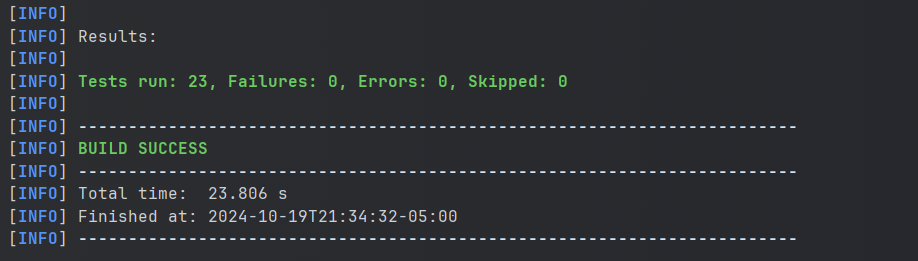

# HEALTHIA- BACKEND

---
## Description

This is the backend of the HealthIA project. It is a RESTful API that provides the necessary endpoints to interact with the database.
this rest serve lets:
- Create a new user
- Update user information
- Delete user
- Get user information
- Get all users
---

## Class Design
The backend is designed with the following classes:
- UserEntitly: this class is used to create a user object.
- UserDTO: this class is used to transfer user data between the controller and the service.
- UserException: this class is used to handle exceptions.
- UserRepository: this class is used to interact with the database.
- UserService: this class is used to interact with the repository and perform the necessary operations.
- UserController: this class is used to interact with the service and provide the necessary endpoints.
- HealthiaApplication: this class is the main.
- RoleEntity: The kind of role a user can have.

The extra classes are:
- SecurityConfig: this class is used to configure the security of the application.
- JwtUtil: this class is used to generate and validate JWT tokens.
- JwtAuthenticationFilter: this class is used to authenticate the user.
- JwtAuthorizationFilter: this class is used to authorize the user.
- UserDetailsServiceImp: this class is used to load the user from the database.

---
## Project Execution
### Requirements:
* __Java__: Version 11 or higher.
* __JDK__: Java Development Kit - version 8 or higher.
* __Browser__: Any browser to open the web application.
* __Maven__: To compile the project.

> [!IMPORTANT]
> In this project, Java version 17 and Maven 3.9.5 were used.
---

## Installation

* First, download the project:

    ```bash
    git clone https://github.com/HealthAI-ECI/HealthAI-Back.git
    ```

* Enter the project directory:

    ```bash
    cd HealthIa-Back
    ```

* Compile the project using Maven:

    ```bash
    mvn clean install
    ```

* Run the project:

    ```bash
    mvn spring-boot:run
    ```

* To access the project, you can click on the following link: [Click here](http://localhost:8080/)

---

## Testing:

### Tests in `HealtIaBackApplicationTests.java`

1. **contextLoads**
    - **Description**: Verifies that the application context loads correctly.
    - **Method**: `contextLoads()`
    - **Expected Result**: The application context loads without errors.

2. **testCreateUser_Success**
    - **Description**: Verifies that creating a user is successful.
    - **Method**: `testCreateUser_Success()`
    - **Expected Result**: The controller response is `201 Created`.

3. **testGetUser_Success**
    - **Description**: Verifies that retrieving an existing user is successful.
    - **Method**: `testGetUser_Success()`
    - **Expected Result**: The controller response is `202 Accepted` and the response body contains the user.

4. **testGetUser_NotFound**
    - **Description**: Verifies that retrieving a non-existent user returns a `404 Not Found` error.
    - **Method**: `testGetUser_NotFound()`
    - **Expected Result**: The controller response is `404 Not Found` and the response body contains the error message `USER_NOT_FOUND`.

5. **testUpdateUser_Success**
    - **Description**: Verifies that updating a user is successful.
    - **Method**: `testUpdateUser_Success()`
    - **Expected Result**: The controller response is `202 Accepted`.

6. **testDeleteUser_Success**
    - **Description**: Verifies that deleting a user is successful.
    - **Method**: `testDeleteUser_Success()`
    - **Expected Result**: The controller response is `202 Accepted` and the response body contains the message `User deleted successfully`.

7. **testDeleteUser_NotFound**
    - **Description**: Verifies that deleting a non-existent user returns a `404 Not Found` error.
    - **Method**: `testDeleteUser_NotFound()`
    - **Expected Result**: The controller response is `404 Not Found` and the response body contains the error message `USER_NOT_FOUND`.

### Tests in `UserServiceTest.java`

1. **showAllUsers_ReturnsUserList**
    - **Description**: Verifies that the service returns a list of users.
    - **Method**: `showAllUsers_ReturnsUserList()`
    - **Expected Result**: The service returns a list containing one user.

2. **getUser_ReturnsUser_WhenExists**
    - **Description**: Verifies that the service returns a user when the user exists.
    - **Method**: `getUser_ReturnsUser_WhenExists()`
    - **Expected Result**: The service returns the correct user.

3. **getUser_ThrowsException_WhenUserDoesNotExist**
    - **Description**: Verifies that the service throws an exception when the user does not exist.
    - **Method**: `getUser_ThrowsException_WhenUserDoesNotExist()`
    - **Expected Result**: The service throws a `HealtIAException`.

4. **createUser_SuccessfullyCreatesUser**
    - **Description**: Verifies that the service successfully creates a user.
    - **Method**: `createUser_SuccessfullyCreatesUser()`
    - **Expected Result**: The service calls the `save` method on the repository.

5. **createUser_ThrowsException_WhenUserAlreadyExists**
    - **Description**: Verifies that the service throws an exception when the user already exists.
    - **Method**: `createUser_ThrowsException_WhenUserAlreadyExists()`
    - **Expected Result**: The service throws a `HealtIAException`.

6. **updateUser_SuccessfullyUpdatesUser**
    - **Description**: Verifies that the service successfully updates a user.
    - **Method**: `updateUser_SuccessfullyUpdatesUser()`
    - **Expected Result**: The service calls the `save` method on the repository and updates the user's full name.

7. **updateUser_ThrowsException_WhenUserDoesNotExist**
    - **Description**: Verifies that the service throws an exception when the user does not exist.
    - **Method**: `updateUser_ThrowsException_WhenUserDoesNotExist()`
    - **Expected Result**: The service throws a `HealtIAException`.

8. **deleteUser_SuccessfullyDeletesUser**
    - **Description**: Verifies that the service successfully deletes a user.
    - **Method**: `deleteUser_SuccessfullyDeletesUser()`
    - **Expected Result**: The service calls the `delete` method on the repository.

9. **deleteUser_ThrowsException_WhenUserDoesNotExist**
    - **Description**: Verifies that the service throws an exception when the user does not exist.
    - **Method**: `deleteUser_ThrowsException_WhenUserDoesNotExist()`
    - **Expected Result**: The service throws a `HealtIAException`.
### Tests in `UserControllerTest.java`

1. **getAllUsers_ReturnsUsers**
    - **Description**: Verifies that the controller returns a list of users.
    - **Method**: `getAllUsers_ReturnsUsers()`
    - **Expected Result**: The controller response is `202 Accepted` and the response body contains the list of users.

2. **getUser_ReturnsUser_WhenExists**
    - **Description**: Verifies that the controller returns a user when the user exists.
    - **Method**: `getUser_ReturnsUser_WhenExists()`
    - **Expected Result**: The controller response is `202 Accepted` and the response body contains the user.

3. **getUser_ReturnsNotFound_WhenUserDoesNotExist**
    - **Description**: Verifies that the controller returns a `404 Not Found` error when the user does not exist.
    - **Method**: `getUser_ReturnsNotFound_WhenUserDoesNotExist()`
    - **Expected Result**: The controller response is `404 Not Found` and the response body contains the error message `USER_NOT_FOUND`.

4. **createUser_CreatesUser_Successfully**
    - **Description**: Verifies that the controller successfully creates a user.
    - **Method**: `createUser_CreatesUser_Successfully()`
    - **Expected Result**: The service method `createUser` is called once.

5. **updateUser_ReturnsAccepted_WhenUpdatedSuccessfully**
    - **Description**: Verifies that the controller returns `202 Accepted` when a user is updated successfully.
    - **Method**: `updateUser_ReturnsAccepted_WhenUpdatedSuccessfully()`
    - **Expected Result**: The service method `updateUser` is called once.

6. **deleteUser_ReturnsAccepted_WhenDeletedSuccessfully**
    - **Description**: Verifies that the controller returns `202 Accepted` when a user is deleted successfully.
    - **Method**: `deleteUser_ReturnsAccepted_WhenDeletedSuccessfully()`
    - **Expected Result**: The controller response is `202 Accepted` and the response body contains the message `User deleted successfully`.

7. **deleteUser_ReturnsNotFound_WhenUserDoesNotExist**
    - **Description**: Verifies that the controller returns a `404 Not Found` error when the user does not exist.
    - **Method**: `deleteUser_ReturnsNotFound_WhenUserDoesNotExist()`
    - **Expected Result**: The controller response is `404 Not Found` and the response body contains the error message `USER_NOT_FOUND`.

### Ejectute the tests


---

## Licencia
Este proyecto está licenciado bajo la Apache License 2.0. Consulta el archivo [LICENSE](LICENSE) para más detalles.

---
## Autor:
* __Sebastian Zamora Urrego__ - [Github](https://github.com/SebZaUr)
* __Johann Abelardo Amaya Lopez__ - [Github](https://github.com/JohannBulls)
* __Cristian David Naranjo Orjuela__ - [Github](https://github.com/cristiandavid0124)
